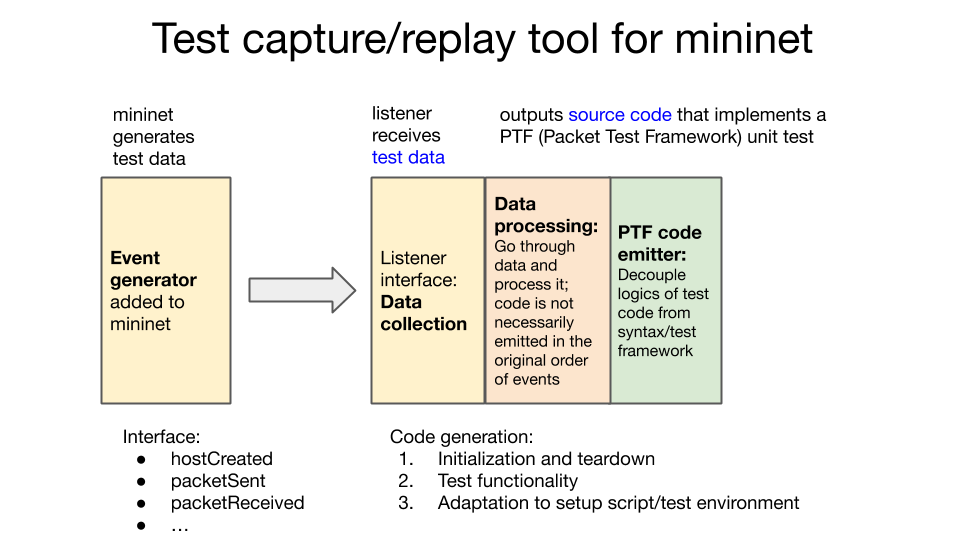
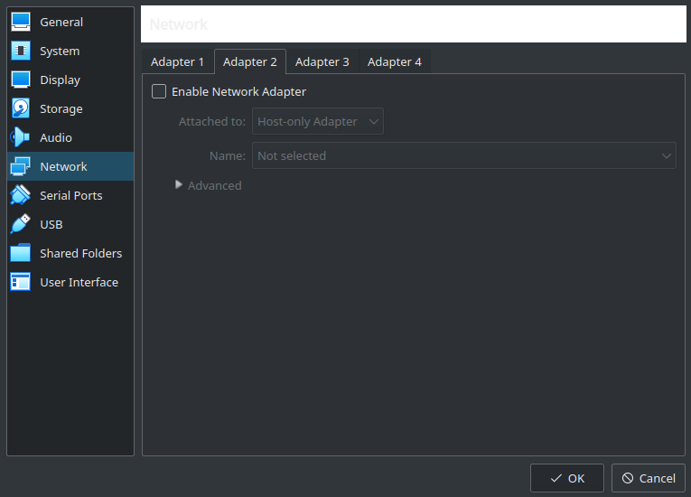

<!-- PROJECT LOGO -->
<p align="center">
  <a href="https://github.com/kirkeasterson/mininet_listener">
    
  </a>

  <h3 align="center">Mininet Listener</h3>

  <p align="center">
    An event handler for <ahref="https://github.com/mininet/mininet">Mininet</a> that will generate PTF source code.
    <br />
    <a href="https://github.com/kirkeasterson/mininet_listener"><strong>Explore the docs »</strong></a>
    <br />
    <br />
    <a href="https://github.com/kirkeasterson/mininet_listener/issues">Report Bug</a>
    ·
    <a href="https://github.com/kirkeasterson/mininet_listener/issues">Request Feature</a>
  </p>
</p>

<!-- TABLE OF CONTENTS -->
## Table of Contents

- [Table of Contents](#table-of-contents)
- [Overview](#overview)
  - [Overall Architecture and Tool Chain](#overall-architecture-and-tool-chain)
  - [Events](#events)
- [Getting Started](#getting-started)
  - [Prerequisites](#prerequisites)
  - [Installation](#installation)
- [Usage](#usage)
- [License](#license)
- [Contact](#contact)


<!-- OVERVIEW -->
## Overview

This project is meant to capture test data from a [Mininet](https://github.com/mininet/mininet) session, send that data to a listener via callbacks, process that data, and then generate [Packet Testing Framework (PTF)](https://github.com/p4lang/ptf) code to test this network configuration.


### Overall Architecture and Tool Chain
The listener implements the [Observer design patter](https://en.wikipedia.org/wiki/Observer_pattern). These callbacks are similar to `hostAdded(host)`, `linkAdded(link)`, `pingSent(src, dst)`, etc. The data sent with the callbacks is used to build data structures containing this processed data. All of the `host` objects are stored in a set. The IP addresses, hostnames, etc are each stored in maps from MAC address to the corresponding piece of data. This data is used to assemble each host in the PTF source code and recreate each ping.

### Events



Callback functions have been added at specific points in Mininet. This information is sent to the listener during the Mininet session. The listener then builds data structures that contain the processed data. Once the session has been terminated, the PTF is generated with a Python generator.


<!-- GETTING STARTED -->
## Getting Started

This project has only been implemented with the instructions below. There is no guarantee of it working if the recommendations are not followed.

### Prerequisites

The [P4](https://p4.org/) tools are powerful and extensive. But because there are so many, it is difficult and time-consuming to manually install them all. For this reason, the Mininet Listener was developed in a virtual machine (VM) with these necessary tools pre-installed. Information about this VM can be found [here](https://p4.org/events/2019-04-30-p4-developer-day/#virtual-machine-1). A direct link to the VM can be found [here](https://bit.ly/p4d2-spring19-adv-vm-2). A backup has been made, in which the VM can be downloaded from [here](https://drive.google.com/uc?export=view&id=1usaNzBZQzvkC4IPQk9VYr8MHaXwRN__v).

[VirtualBox](https://www.virtualbox.org/) is required to run the VM. It is recommended to also install the [VirtualBox guest additions](https://www.virtualbox.org/manual/ch04.html), but this is not necessary. When importing the `.ova` file you will have to agree to license terms for [Apache2](https://ubuntu.com/server/docs/web-servers-apache).

The configuration of the VM is 4GB of RAM and 4 core CPU. These are the recommended minimum system requirements. When imported, the VM takes approximately 8GB of space on the drive. An ideal host machine has at least double these requirements.

username: `sdn`

password: `rocks`

*NOTE:*
When starting the VM for the first time, one may see the following error:
```
Could not start the machine ONOS+P4 tutorial (Ubuntu 18.04) (2019-04-25) because the following physical network interfaces were not found:

vboxnet0 (adapter 2)

You can either change the machine's network settings or stop the machine.
```
This can be solved by disabling the second network adapter in the settings for the VM as seen below.



### Installation

The callback functions can be added to the source of Mininet, but a [forked version of Mininet](https://github.com/KirkEasterson/mininet) has been created to make use easier. To implement this modified version of Mininet, run the following commands from the `$HOME` directory in the VM.


HTTPS:
```
mkdir modified_mininet_with_listener && cd $_
git clone https://github.com/KirkEasterson/mininet_listener.git
git clone https://github.com/KirkEasterson/mininet.git
cd mininet
util/install.sh -fnv # Install the modified version of Mininet
```

SSH:
```
mkdir modified_mininet_with_listener && cd $_
git clone git@github.com:KirkEasterson/mininet_listener.git
git clone git@github.com:KirkEasterson/mininet.git
cd mininet
util/install.sh -fnv # Install the modified version of Mininet
```
The installation will result in a lot of terminal output with what looks like errors. This is normal.

<!-- USAGE -->
## Usage

Once the modified version is installed, one can do a basic test to ensure that the PTF code is being generated and is able to be run. To run a basic Mininet test session, use the following command from the `mininet/` directory:
```
sudo mn --test pingall
```
This will result in to files: `mininet_listener.log` is a log for the listener and `mininet_listener_ptf.py` is the generated PTF source code. To run the PTF source code, sue the following command:
```
```


<!-- LICENSE -->
## License


<!-- CONTACT -->
## Contact

Kirk Easterson - kirk.easterson@gmail.com

Cyrille Artho - artho@kth.se

Project Link: [https://github.com/KirkEasterson/mininet_listener](https://github.com/KirkEasterson/mininet_listener)